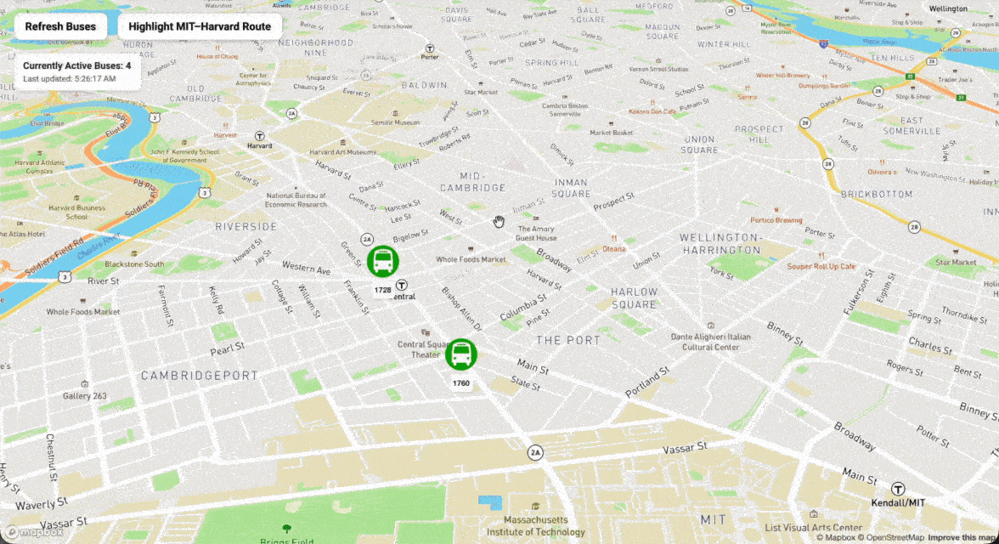

# MIT - Harvard Live Bus Tracker

An interactive web app that displays live MBTA Route 1 bus locations on a Mapbox map and updates them in real time.

### Live Demo

[https://nicortiz1231.github.io/MIT-Bus-Tracker/](https://nicortiz1231.github.io/MIT-Bus-Tracker/)

## Showcase



## About the Project

This project originally started as part of the MIT xPRO Full Stack Development program.

It was one of the more challenging projects for me at the time, but it taught me a lot about working with APIs, fetching public data, and using geographic coordinates to display live information on a map.

The app retrieves live MBTA vehicle data and displays active Route 1 buses in the Cambridge/Boston area. It also includes a route visualization between MIT and Harvard.

I later revisited the project to clean up the code, improve the user interface, add error handling, and make it fully deployable as a portfolio project.

## Features

- Displays live MBTA Route 1 bus locations
- Automatically refreshes bus data every 10 seconds
- Shows the number of currently active buses
- Displays the last time the bus data was updated
- Clickable bus markers with additional bus information
- Manual refresh button
- MIT-to-Harvard route visualization
- Basic API error handling
- Responsive map-based interface

## Technologies Used

- HTML
- CSS
- JavaScript
- MBTA API
- Mapbox GL JS
- Mapbox Directions API
- GitHub Pages

## What I Learned

This project was particularly difficult for me when I first built it, but it became an important learning experience.

Some of the main concepts I worked with were:

- Fetching data from a public API
- Using `async` / `await`
- Working with JSON responses
- Reading and using latitude and longitude coordinates
- Updating the browser UI with live data
- Creating and updating map markers
- Working with third-party libraries such as Mapbox
- Handling API errors
- Using timers to refresh data automatically
- Debugging JavaScript in the browser
- Using Git branches and commits to safely make changes
- Deploying a static web application with GitHub Pages

Revisiting the project later also helped me understand the code much better than when I originally completed the assignment. I was able to refactor parts of the JavaScript, remove unused code, improve the UI, add bus information popups, and make the project easier to maintain.

## Running the Project Locally

Clone the repository:

```bash
git clone https://github.com/nicortiz1231/MIT-Bus-Tracker.git
